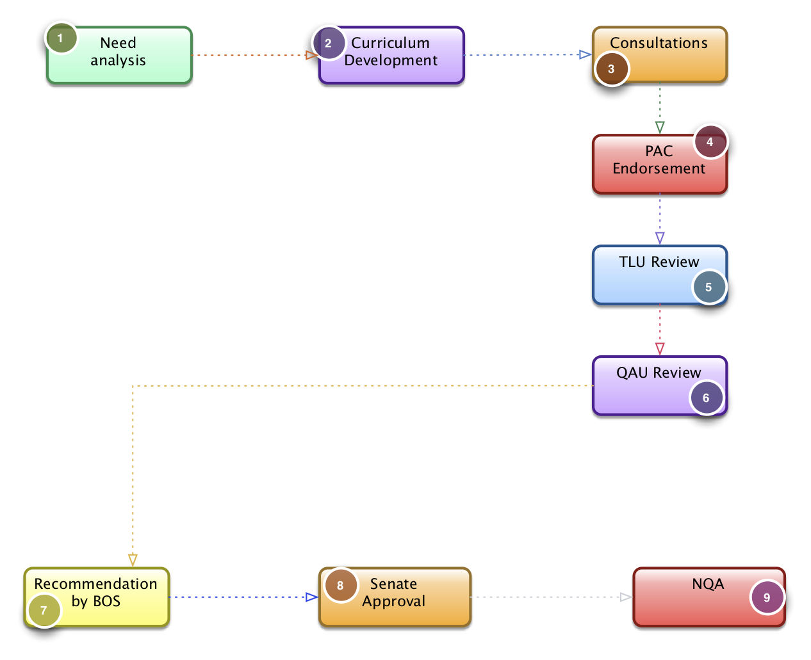
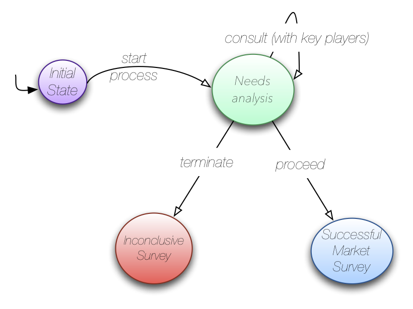
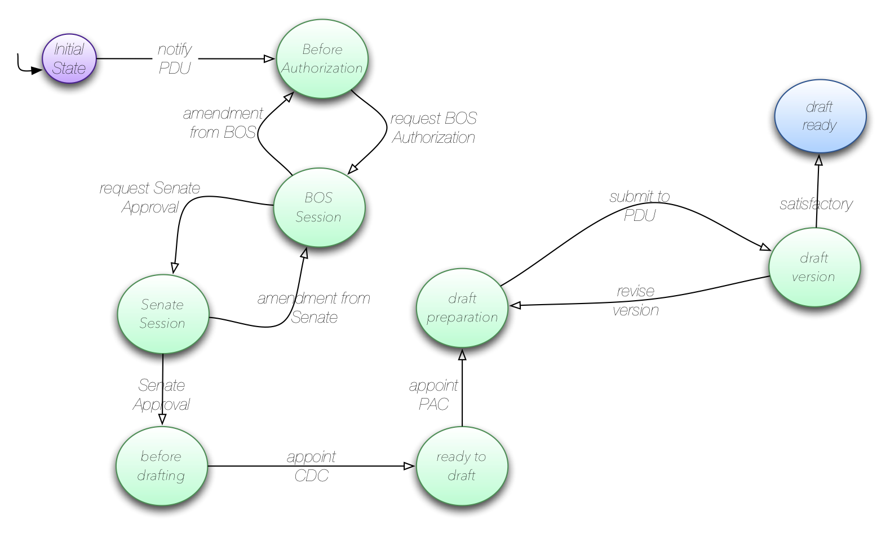
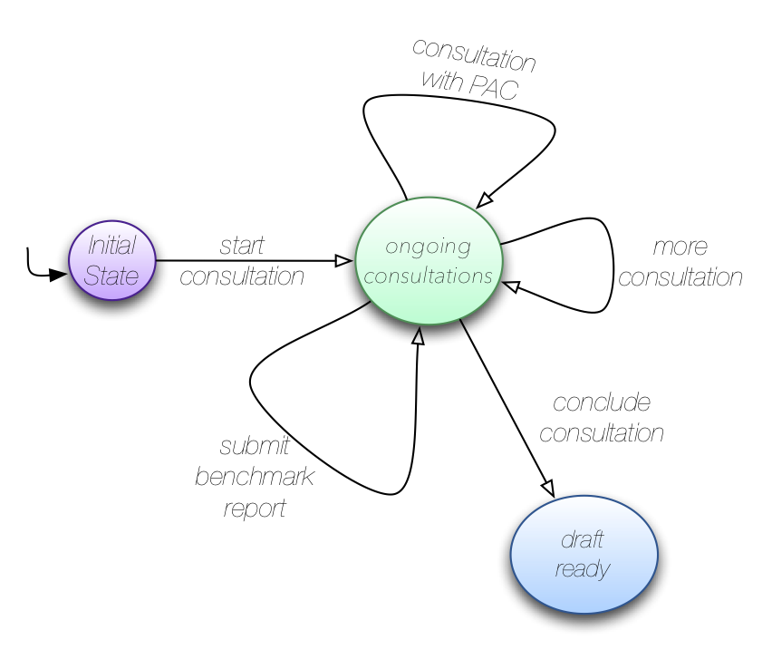
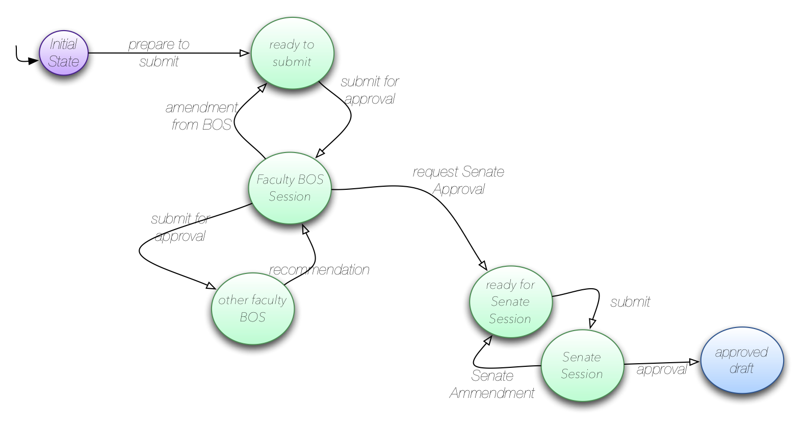
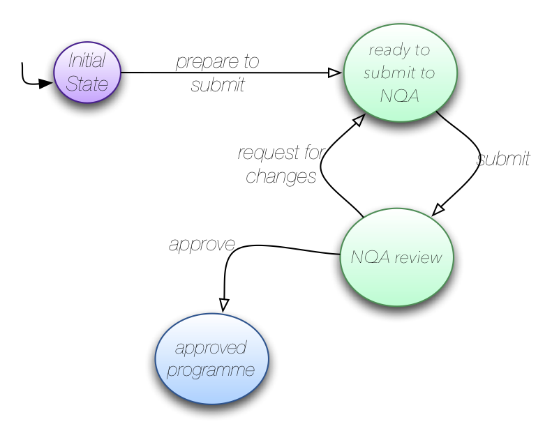
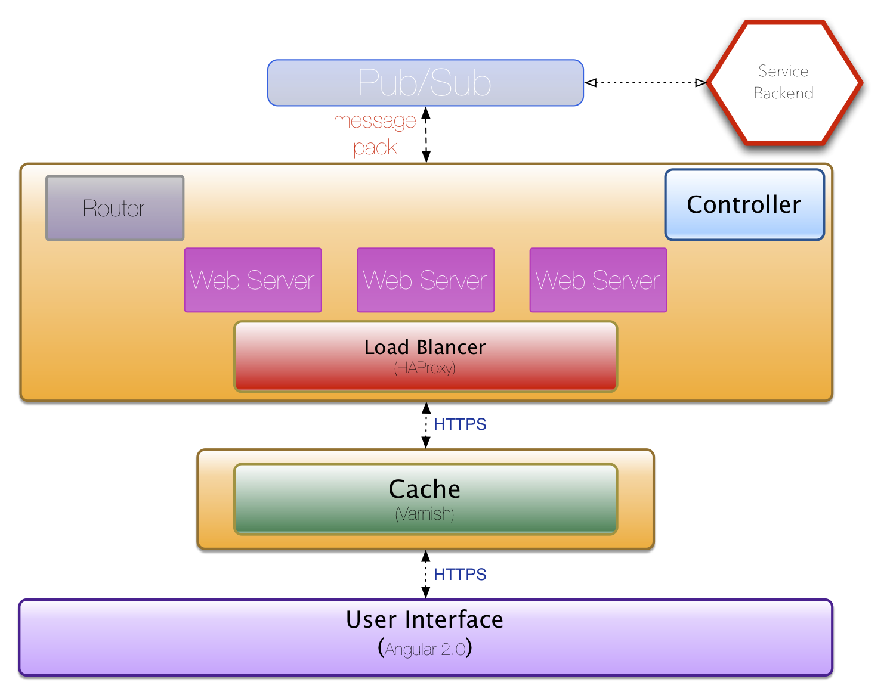
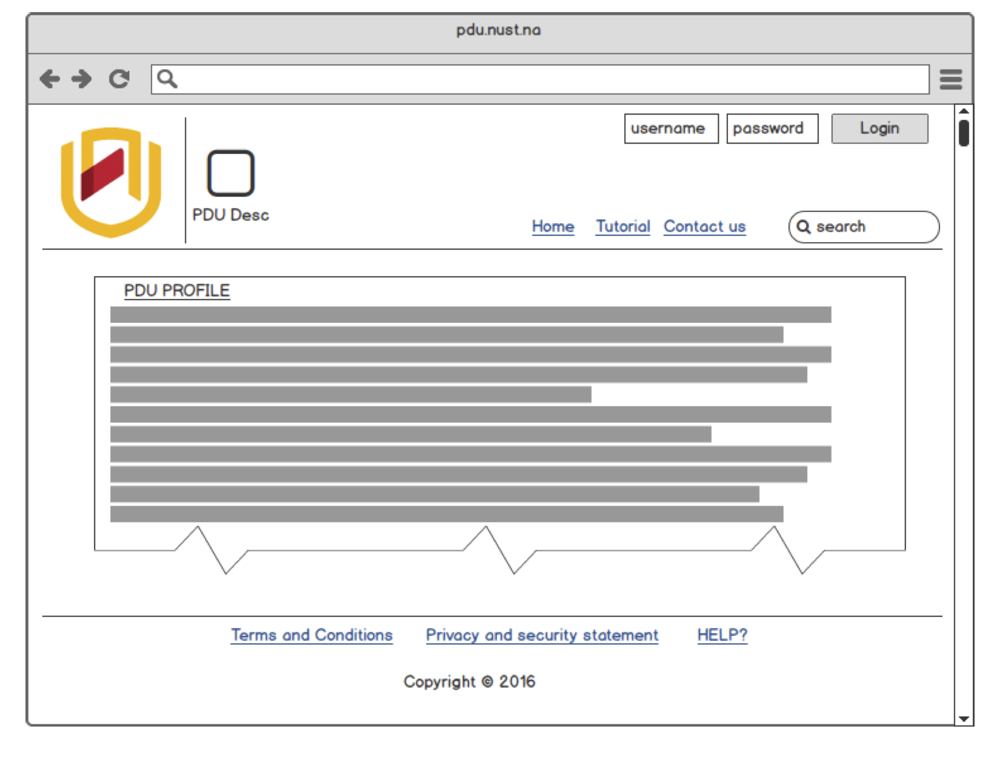

# General Introduction

The rationale of the PDU application is to automate the steps followed while developing a curriculum. Overall, there are
nine steps as depicted in the diagram below.

1. The *Need Analysis* step determines whether the programme is on demand or not. It is carried out according to the following diagram

2. The *Curriculum Development* step guides the drafting of the programme once the need analysis is conclusive. It is executed as follows 

3. The *Consultations* and *PAC Endorsement* steps highlight the improvement of the draft from external partners. 

4. The internal review steps (__TLU__ and __QAU__)   

5. The *BOS* and *Senate* steps guide in seeking approval from the decision making bodies within the institution. 

6. The last step shows how the programme is registered with NQA 

# Architecture

## General Description

Figure  depicts the overall architecture of the application. As it appears we adopted a **client/server** architecture. Below we describe the key components of the architecture the tools used to implement it.

## Key Components

 The client side is represented, on our diagram, by the *User Interface* component. It offers a collection of views used to capture information from the users and to convey information back to them. The communication between the client and the server-side components should follow the **http** protocol. It should be emphasized that the version of the **http** protocol to be adopted should integrate *advanced security* features as well as a better utilization of the underlying transport protocols (e.g., TCP, UDP, etc.)

Between the client and the server, we have introduced an intermediate layer that serves essentially two purposes. First, as a cache this layer checks whether valid responses exist for a request. It shields the Web server from attacks and reduces the response time. Second, as a load balancer it allows for the use of several instances of the Web server to support concurrency and scalability.

The next layer encompasses several instances of the Web Sever. The desired properties here include *high availability* and *scalability*. The number of instances will grow with the activities on the application. The Web server is endowed with a routing mechanism, controlled by a **Router** component, which identifies the right **controllers** to handle a request. Controllers are inspired from the MVC[1] architectural style. It should be noted that here we wish to separate between *command* and *query* operations (see CQRS[2]). The business logic in a controller at the Web server layer is quite limited. The tasks generally include *user authentication*, *operation authorization*, *request data sanitization*, etc.

Once a request has been pushed to a controller and the preliminary actions taken, the actual operation is invoked from a micro service. Indeed, we organize the functionality offered in the application into **micro services**. A [micro service](http://martinfowler.com/articles/microservices.html) is an architectural style that structures an application into a collection of independent services. Each service is a specialized component, which implements a specific or set of specific functionality in the application. In its current form our architecture includes four (04) types[3] of micro services:

1. **yarub**: the Communication Management micro service
... the main responsibility of this micro service is to manage (dispatch and store) communication between the various actors involved in a given faculty curriculum development.
2. **yester**: the Resource Management micro service
... this micro service keeps track of the actors themselves and the resources they have access to.
3. **kano**: the Document Management micro service
... this micro service helps archive all versions of all documents used during a specific curriculum development process. It might also include an online editor to support the collaborative writeup.
4. **sennar**: the Workflow Management micro service
... this micro service is a highly concurrent workflow engine.

The communication between a controller and a micro service is handled through the *publish/subscribe* (pub/sub) pattern. The routing mechanism we plan to adopt is *content-based*, i.e., depending on the content of the event published to the pub/sub tool will determine which micro service(s) should receive the event for further processing. It should be noted that we intend to use *data serialization* between the controllers and the pub/sub.

Moreover, in order to support the anticipated high concurrency of workflow engine as well as its scalability, any communication with the workflow engine is controlled by a *message queue*. In addition to delivering messages to the workflow engine, the message queue should control the rate at which messages/events are submitted. In short, it should switch between the *push* and *pull* protocols.

## Tools

Not all components in our architecture should be implemented. For a number of components, we shall select a tool and configure it to suit our needs. Below, we list our recommendations for the needed tools.

1. HTTP: **HTTP2**
2. Caching: **Varnish**[4]
3. Load balancing: **HAProxy**[5]
4. Message Queue and Pub/Sub: ** Apache kafka**[6]
6. Data serialization: **MessagePack**[7]

## Languages and Frameworks

The User Interface component will be implemented using Angular.js [8]

which we suggest should be implemented using **Angular**[1] 2.0. As for the Web server component, we shall implement it using Node.js [9] a Javascript runtime built on top of V8. Finally the workflow engine will be implemented using clojure.

## References

[1]: MVC stands Model-View-Controller. It is an architectural style that comprises a model to structure and access the data, a view to display information related to the data and a controller to process information related to the data.
[2]: [CQRS](http://martinfowler.com/bliki/CQRS.html) stands for Command Query Responsibility Segregation.
[3]: Note that there could be several instances of any given type of micro service.
[4]: [Varnish](http://varnish-cache.org) is a Web application accelerator. Installed in front of a Web application, it speeds it up significantly.
[5]: [HAProxy](http://www.haproxy.org) is a load balancer and proxying solution used in several OS.
[6]: [kafka](http://kafka.apache.org)
[7]: [MessagePack](http://msgpack.org)
[8]: [Angular](https://angularjs.org)
[9]: [Node.js](http://nodejs.org)

# PDU Project Mockup

A mockup of our implementation is depicted below

# Notes on Production Environment

To be discussed...
